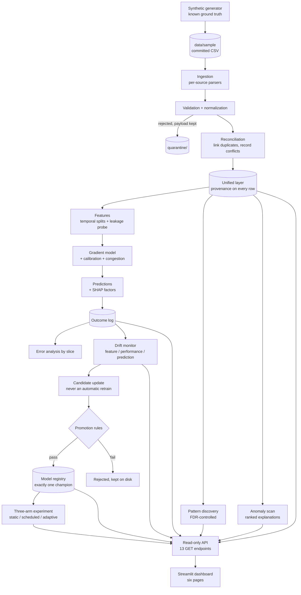

# UrbanSense

**An adaptive urban intelligence system** that ingests historical, real-time and document-based
urban data through independent validation pipelines; reconciles duplicates and conflicts while
preserving data provenance; discovers evolving spatial, temporal and conditional patterns; detects
anomalies; forecasts urban problems; explains predictions; evaluates prediction errors and
interventions; detects data and concept drift; and selectively adapts and versions its models when
new evidence shows an update is justified.

The full design is in [`docs/SPEC.md`](docs/SPEC.md). It is built in small, tested phases.

**All data is synthetic.** It is generated by this repository with known planted ground truth, so
every number below is a simulation result — not a measurement of a city and not a forecast for one.
See [what is synthetic](#what-is-synthetic-and-what-that-costs).

> **Status: Phase 9 complete — the project is feature-complete for v1.** The pipeline runs end to
> end, *adapts*, and is *inspectable*: generate → ingest → validate → reconcile → features →
> forecast → discover → predict → explain → monitor → decide → compare → serve → show. The planted
> level shift is detected with zero false alarms, each detection raises a candidate update rather
> than a retrain, and challengers are judged against config-declared rules.
>
> Phase 8 then tested whether that machinery earns its place, against the baseline Phase 7 skipped:
> **a 28-day calendar retrain matched the adaptive system across five seeds at 21% less training**,
> so the honest answer is that retraining matters and the drift machinery does not yet pay for
> itself on this data. [The numbers, and where adaptation did not help.](docs/experiments.md)
>
> A read-only [API](docs/api.md) and a six-page Streamlit dashboard serve the stored artifacts on
> localhost, and `docker compose up` runs both. Document ingestion, the human review UI and
> intervention tracking are **[not implemented](#not-implemented)**.

---

## How it fits together



The serving layer recomputes nothing. The API opens files the pipeline already wrote, and the
dashboard reads either the API or those same files — so what you see on a page is what was recorded,
not a fresh run that might disagree with it. A fuller walkthrough is in
[`docs/architecture.md`](docs/architecture.md).

## Why the schema came first

UrbanSense makes a handful of promises that are easy to state and easy to break quietly. Phase 0
encodes them as validators on the canonical `Observation` record, so a violation fails at the
boundary instead of silently corrupting the unified data layer:

| Promise | Enforced by |
|---|---|
| **Time is never ambiguous.** Naive datetimes are rejected; every instant is stored in UTC. | `require_utc` |
| **"When it happened" ≠ "when we were told".** Receipt cannot precede the event outside quarantine. | `_received_not_before_event` |
| **No future data.** An `event_time` beyond now is a clock error or leakage, never a measurement. | `_event_time_not_in_future` |
| **Missing is never zero.** `value` is `float \| None`; an imputed value must declare its method. | `_missing_is_not_zero` |
| **Provenance is mandatory.** Not optional, not defaulted — every value says where it came from. | required `provenance` field |
| **Document values are auditable.** Document data must carry the document, page and original text. | `_document_values_carry_document_provenance` |
| **No hallucinated facts.** An `INFERRED` extraction cannot be born `VALID`; it needs review. | `_inferred_values_are_not_facts` |
| **Units are never dropped.** Normalization keeps the original value *and* unit alongside the canonical ones. | `_unit_normalization_keeps_original` |
| **Nothing is destroyed.** Duplicates are linked, conflicts are recorded, invalid records are quarantined with their raw payload. | `duplicate_of`, `conflicts_with`, `QuarantineRecord` |

Raw data is immutable: nothing in the codebase overwrites or deletes inside `data/raw/`. Rejected
and suspicious records go to `quarantine/` *with the payload exactly as received*, because a record
that fails validation is the one a reviewer most needs to see.

## Config-driven by construction

**Traffic is the only problem type in v1**, and nothing in the code special-cases it. A problem
domain is one YAML file:

```
configs/
├── base.yaml                   # run-wide settings; lists which problems to load
└── problems/
    ├── traffic.yaml            # the v1 domain: metrics, units, aliases, plausible ranges
    └── _template.yaml          # copy this to add flood or waste — no code change
```

Source terminology maps to canonical metrics in config, so a feed saying `vehicle count`, a
document saying `vehicles observed` and a warehouse column called `flow` all resolve to
`traffic_volume`.

## Quickstart

Requires **Python 3.11+**. `make` is optional — every task has a plain `python` equivalent, and the
`python` commands are the ones that are actually tested.

```bash
git clone <your-fork-url> urbansense && cd urbansense
python -m venv .venv
source .venv/bin/activate                 # Windows: .venv\Scripts\activate
python -m pip install -e ".[dev,dashboard]"
```

The demo dataset is committed, so there is nothing to download. Run the pipeline in order — each
step writes the artifact the next one reads:

```bash
python scripts/ingest_demo.py                     # ingest it, see what came out
python scripts/validate_demo.py                   # validate, normalize, quarantine
python scripts/reconcile_demo.py                  # link duplicates, record conflicts, unify
python scripts/reconcile_demo.py --explain REC-065679   # one record's full origin
python scripts/train_baseline.py                  # features, splits, baselines, gradient model
python scripts/discover_patterns.py               # patterns, evolution, anomaly scan
python scripts/predict_demo.py --zone ZONE-B      # one prediction, with factors and sources
python scripts/error_report.py                    # errors by condition, time, zone, slice
python scripts/replay_adaptive.py                 # drift, candidates, static vs adaptive
python scripts/run_experiment.py                  # three-arm experiment (~12 min)
python scripts/simulate_stream.py --limit 20      # replay held-out data as a live stream
python scripts/generate_demo_data.py --out data/sample --force   # regenerate the dataset
```

Then look at it:

```bash
python scripts/serve_api.py                       # read-only API on 127.0.0.1:8000, /docs
python scripts/serve_dashboard.py                 # dashboard on 127.0.0.1:8501
python scripts/serve_dashboard.py --check          # which artifacts are ready, then exit
```

Or in containers, which bake every artifact at build time so nothing is computed at runtime:

```bash
docker compose build     # ~10 min
docker compose up        # API on 127.0.0.1:8000, dashboard on 127.0.0.1:8501
```

Every script takes `--help`, and a page or endpoint whose artifact has not been produced says so and
names the command that would produce it rather than failing.

### Checks

```bash
python -m ruff check src tests scripts
python -m ruff format --check src tests scripts
python -m mypy

# 927 tests, run in two chunks. The whole suite in one process exhausts memory
# on a modest machine: the experiment tests generate and replay several
# synthetic datasets, each holding a feature table and three models.
python -m pytest --ignore=tests/test_experiments.py -p no:cacheprovider
python -m pytest tests/test_experiments.py -p no:cacheprovider
```

With `make` available, `make help` lists every target; `make check` runs lint, types and both test
chunks.

Then, in a Python shell:

```python
from pathlib import Path
from urbansense.config import load_settings
from urbansense.ingestion import ZoneRegistry, load_historical
from urbansense.schemas import ProblemType

settings = load_settings()
settings.enabled_problems                                     # (<ProblemType.TRAFFIC>,)
settings.resolve_metric(ProblemType.TRAFFIC, "vehicle count") # -> traffic_volume

result = load_historical(
    Path("data/sample/traffic_history.csv"),
    settings=settings,
    registry=ZoneRegistry.from_csv(Path("data/sample/zones.csv")),
)
len(result.observations), len(result.rejected)   # (58994, 3)
result.accounts_for_every_row                    # True — nothing dropped silently
```

## The demo dataset has known answers

Later phases claim to discover patterns, detect drift and catch bad records. Those claims are only
testable against data where the answers were planted on purpose, so the generator writes
`data/sample/ground_truth.json` recording every injected effect — with its parameters and the exact
`record_id`s involved.

| Planted in the data | What a later phase should find |
|---|---|
| Friday 18:00–20:00 in `ZONE-B`, ×2.2 volume and slower speeds | a spatio-temporal pattern, localized to one zone — **Phase 5 discovers it at ×2.287** |
| Rainfall → +3% volume per mm (capped, emitted as its own series) | a conditional pattern, by joining two sources — **found at +3.09%/mm** |
| Baseline ×1.18 in `ZONE-A`/`ZONE-B` from 2026-03-01 | drift, with `ZONE-C`/`ZONE-D` as controls — **level shifts at ×1.176 / ×1.167, none in the controls** |
| `ZONE-D` frozen at one value for 2.5 days | sensor failure — plausible-looking, so harder than a gap — **39/60 readings flagged on value alone** |
| 319 missing values as **empty cells** | missing data, never read as zero |
| 12 duplicates, 8 cross-source conflicts | records to *link* and *flag*, not delete — **all 20 caught in Phase 3** |
| 9 invalid rows (negative volume, 480 km/h, bad timestamp, bogus unit) | quarantine candidates — **all 9 caught in Phase 2** |

**The CSVs contain no labels** — only `record_id, source_id, interval_end_local, location_id,
metric, value, unit`, which is what a real feed sends. A label column would be a leakage channel: a
phase that could read the answer off its input would be credited with a discovery it never made.

Two conventions to know before reading the data:

- `interval_end_local` stamps the **end** of the measurement hour, in the source's local time
  (IST), with each sensor's clock skew baked in. Ingestion snaps to the nearest interval to absorb
  the skew and keeps the raw instant as `source_time`, so a drifting clock stays detectable.
- An empty `value` cell means **missing**. A dry hour of rainfall is a measured `0.0` — different
  fact, different representation.

Verify the Friday effect is genuinely in the data, derived from the timestamp alone:

```bash
python -c "
import csv, statistics as s
from datetime import datetime, timedelta
fri, oth = [], []
for r in csv.DictReader(open('data/sample/traffic_history.csv')):
    if r['location_id'] != 'ZONE-B' or r['metric'] != 'traffic_volume' or not r['value']:
        continue
    start = datetime.fromisoformat(r['interval_end_local']) - timedelta(hours=1)
    (fri if start.weekday() == 4 and 18 <= start.hour < 20 else oth).append(float(r['value']))
print(f'Zone B Fri 18-20: {s.mean(fri):,.0f}  vs other hours: {s.mean(oth):,.0f}')
"
```

## What validation catches (Phase 2)

`validate_and_normalize` normalizes units, locations and recency, then judges. Run it:

```bash
python scripts/validate_demo.py
```

On the demo dataset: **58,997 rows in → 58,928 valid + 69 quarantined**, partition exact.

| reason | count | what it was |
|---|---|---|
| `sensor_failure` | 60 | the ZONE-D frozen window, matched to ground truth exactly |
| `invalid_value` | 6 | 4 negative volumes + 2 impossible speeds (480 km/h) |
| `invalid_timestamp` | 2 | carried forward from ingestion |
| `unknown_unit` | 1 | `vehicles/fortnight` — not coerced |

**Precision 1.000, recall 1.000** against the planted defects, zero false positives. 47 rows (0.08%)
flagged `SUSPECT` and **kept**. `sensor-D21` reports `FAILED`, the rest `OK`.

Three decisions worth knowing, each from the spec:

**Impossible is quarantined; unusual is flagged and kept.** −484 vehicles/hour is not a measurement
of anything. But 20,000 where 5,000 is normal could be a festival, an accident or a diversion, so
it stays in the usable stream with `validation_status=SUSPECT` (SPEC §16). Nothing is clipped —
silencing a negative count with `max(0, value)` would turn a sensor fault into a plausible reading.

**Similar location names are never auto-matched.** `Anna Nagar East` scores 80% string similarity
against the registered `Anna Nagar` and is still sent to review, because they are different roads
and merging them would be permanent and invisible (SPEC §13). The similarity score is computed only
to name candidates for the reviewer.

**Recency is a separate axis from `source_type`.** A reading can arrive on the live feed and still
be months old, so `source_type` keeps recording *which stream it came through* while
`attributes["recency"]` records *how old it was*. Collapsing them would make a newly uploaded 2022
report indistinguishable from this hour's measurement (SPEC §12).

```python
from pathlib import Path
from urbansense.config import load_settings
from urbansense.data_integrity import validate_and_normalize
from urbansense.ingestion import load_historical
from urbansense.preprocessing import load_location_registry

result = validate_and_normalize(
    load_historical(Path("data/sample/traffic_history.csv")),
    settings=load_settings(),
    registry=load_location_registry(),
)
result.accounts_for_every_row          # True — valid + quarantined == input
result.by_reason                       # {sensor_failure: 60, invalid_value: 6, ...}
len(result.suspicious)                 # 47, still inside result.valid
result.source_health["sensor-D21"]     # FAILED, 1 frozen run of 60 readings
```

## What reconciliation produces (Phase 3)

```bash
python scripts/reconcile_demo.py
```

58,928 valid observations → **58,900 unified + 12 duplicate-linked + 16 conflicted**, an exact and
disjoint three-way partition. Precision and recall both **1.000** on the 12 planted duplicates and
the 8 planted conflicts.

Three decisions, each straight from the spec:

**Duplicates are linked, never deleted.** The representative goes to the unified layer carrying
`source_references` for every member; the other records survive with `duplicate_of` set. Deleting
the copy is the obvious implementation and is exactly wrong — a mistaken duplicate judgement has to
stay recoverable (SPEC §9).

**Conflicts keep every value and no winner is picked.** All 8 disputes go to
`quarantine/conflicts/` with both candidates, their sources, the policy name and `resolved: false`.
Neither member reaches the unified layer, so a disputed slot is a **visible hole** rather than a
guess. "Real-time is fresher" and "historical is authoritative" are both policies, and a policy
that discards the values it rejects destroys the evidence that it was the wrong policy (SPEC §10).

**Same ≠ similar.** Two records only compare if they share an `ObservationKey` — location, event
time, metric, unit, duration and aggregation. Same value at a different hour is not a duplicate;
`2050 vehicles/15min` and `8200 vehicles/hour` at the same instant are not a conflict.

```python
from urbansense.data_integrity import explain_provenance, reconcile, validate_and_normalize

result = reconcile(validated, settings=load_settings())
result.accounts_for_every_observation     # True — exactly one place each
result.observation_ids_are_disjoint       # True — and no record in two buckets
result.by_group_kind                      # {SAME_SOURCE_REPEAT: 12, CROSS_SOURCE_AGREEMENT: 0}
len(result.conflicts)                     # 8, all unresolved

# source-specific views come before the unified one (SPEC section 20)
len(result.historical_view), len(result.real_time_view), len(result.unified)

# where did this value come from?
print(explain_provenance("REC-065679", result).describe())
```

## What the model does (Phase 4)

```bash
python scripts/train_baseline.py
```

Test split, `traffic_volume` at +1h. Baselines first, because a model that cannot beat "the traffic
next hour will be what it is now" has learned nothing worth deploying:

| model | MAE | RMSE | relative MAE |
|---|---|---|---|
| `naive_last` | 972.4 | 1,454.5 | 34.1% |
| `same_hour_last_week` | 589.9 | 923.9 | 20.7% |
| **`gradient_boosting`** | **284.9** | **508.9** | **10.0%** |

70.7% better than naive overall and better in every zone. On the **July holdout** — a month nothing
trained on — overall MAE is 295.2, only 3.6% worse, so the test split was barely flattering.

### Leakage prevention is the load-bearing part

A model that scores well because it saw the answer is worse than no model, because it is convincing.
So there are two independent defences, and the suite proves the second one fires:

- **Declared** — every feature states its backward offset; a negative one raises at construction.
- **Probed** — `detect_leakage()` perturbs all data after `t`, rebuilds the features, and flags any
  value that moved. The tests plant a `lead_1h` feature reading `t + 1h` and **require it to be
  caught**. A checker that never fires proves nothing.

Splits are temporal only, with a 168h gap at both boundaries. `temporal_split()` has no seed
parameter anywhere: a shuffled split puts hour 14 in train and hour 15 in test, so the model predicts
what it has already seen and scores beautifully while meaning nothing.

### Where it is weak

- **The Friday ZONE-B peak**: MAE 4,194 there against 284.9 overall. The planted pattern appears in
  only **47 training rows**, which is the root cause and is not fixable by tuning. The model is still
  recovering most of it — ignoring the pattern entirely would give MAE 10,282, so it is **59%
  better** than that counterfactual, which is what the test actually asserts.
- On the holdout, `ZONE-C Fri 18-20` is **worse than naive** (256.8 vs 224.3). One slice of eight,
  but it is a real loss and the report prints it.
- Training straddles the planted drift, so train is mostly pre-drift and test entirely post-drift.
  Lag features carry the new level; Phase 7 detects the shift explicitly and adapts to it.

```python
from urbansense.features import build_feature_table, detect_leakage, load_feature_set
from urbansense.evaluation import temporal_split
from urbansense.prediction import GradientForecaster

features = load_feature_set()
report = detect_leakage(reconciled, features)   # probe before building anything
assert report.is_clean

table = build_feature_table(reconciled, features, timezone_offset_hours=5.5)
split = temporal_split(table)                   # no seed parameter exists
split.is_strictly_ordered                       # True, with a 168h gap each side

model = GradientForecaster().fit(split.train)
model.calibrate_interval(split.validation)      # never on test
point, lower, upper = model.predict_with_interval(split.test)
```

## What discovery finds (Phase 5)

```bash
python scripts/discover_patterns.py
```

Phase 4 **measured** the Friday ZONE-B effect by being told where to look — the slice was named in
the test. Phase 5 has to **find** it:

```
4 pattern(s) from 672 hypotheses at FDR q=0.05; 0 cell(s) too sparse to test;
58,900 unified rows; seed 20260101
```

| discovered from data alone | effect | planted |
|---|---|---|
| `ZONE-B` + Friday + 18:00–20:00 | **×2.287** (1.939–2.404) | ×2.2 |
| rainfall → `traffic_volume` | **+0.0309/mm** (+0.0287–+0.0332) | +0.03/mm |
| `ZONE-A` baseline shift from 2026-03 | **×1.176** (1.118–1.233) | ×1.18 |
| `ZONE-B` baseline shift from 2026-03 | **×1.167** (1.110–1.220) | ×1.18 |

**Zero spurious discoveries** in `ZONE-C`/`ZONE-D`, where nothing was planted — which matters more
than recovering the three real effects. 4 zones × 7 weekdays × 24 hours is 672 hypotheses, where
~34 cells would clear p<0.05 by chance, so Benjamini-Hochberg at q=0.05 gates the scan and the
hypothesis count travels with every report. One pattern out of 672 tests is a different claim from
one out of ten.

Three confounds are controlled rather than discovered: each cell is compared against the same zone
and hour on *other weekdays* (hour of day, zone level), and each lift is divided by the median lift
across zones (the shared weekday effect). The raw ZONE-B figure is 2.379; the localized one is
2.287. Every pattern records what was controlled **and** what was not.

### Interaction is tested, never assumed

```
Friday x rain at ZONE-B + 18:00-20:00: NO_EVIDENCE
  scale: log(value) — effects composing multiplicatively show no interaction
  interaction: -0.0635 (-0.1966 to +0.0696);  cells: both=16
  note: absence of evidence, not evidence of absence
```

The planted data composes multiplicatively, so the truth on the log scale is exactly zero. With 16
wet Friday evenings the point estimate is −0.064, so a point-estimate test would report a spurious
*negative* interaction — the verdict comes from the interval, and the test suite **fails** on a
`SUPPORTED` verdict.

### Anomalies are explained, never declared errors

54 flagged of 26,233 scanned (0.21%): **4/4** planted negative volumes, **39/60** frozen readings,
and **0 of 78** recurring Friday peak rows — within its own weekday-and-hour group, the Friday peak
*is* the norm. Each anomaly carries ranked candidate explanations (rainfall, a covering pattern, a
level shift, a suspect sensor, or `UNEXPLAINED` stated outright), and `is_error` is `None`
everywhere, on a frozen record with no setter. A flagged reading may be a sensor fault, a festival or
an accident; the number alone cannot separate them.

The frozen recall is a **floor, not perfection**: the sensor froze at 316 vehicles/hour, which is
implausible at 09:00 and unremarkable at 03:00, so the 21 misses are overnight hours. Phase 2's
frozen-run detector catches those by repetition instead — two detectors with different blind spots.

Scoring runs on the pre-quarantine population, because Phase 2 removes every planted defect before
discovery runs. **Discovery itself reads the unified layer only, and no module under `src/` ever
reads `ground_truth.json`** — an AST-based source-tree test enforces it.

```python
from urbansense.patterns import PatternStore, discover_patterns

result = discover_patterns(reconciled, timezone_offset_hours=5.5)
print(result.header())          # the multiple-testing context, before any finding
result.stats.discoveries        # 4, excluding the descriptive profiles
result.supported_interactions   # () — tested, and not supported

PatternStore().write(result)    # reports/patterns/patterns-<stamp>.json, append-only
```

Details, including why the level-shift reference is the lower quartile rather than the median, are in
[`docs/patterns.md`](docs/patterns.md).

## What a prediction says (Phase 6)

```bash
python scripts/predict_demo.py --zone ZONE-B --date 2026-06-26
python scripts/error_report.py
```

Phase 4 produced a number. Phase 6 produces something a person can act on, with every claim
labelled for what it is:

```
ZONE-B  2026-06-26 18:00 local
  congestion probability   99.1%  (calibrated)
  severity                severe  (x2.03 the zone threshold of 4,652)
  predicted volume         9,455 [8,712 to 9,717]
  interval tightness       89.4%  (how precise the volume is, not a chance)

contributing factors (shap_tree, additive):
  historical traffic    84.4%  contributed +6,027 upward to the prediction
  peak hour              6.6%  contributed   +469 upward to the prediction
  weekday                2.3%  contributed   +167 upward to the prediction
  baseline 2,312 plus the contributions above reconstructs the predicted 9,455
  these are associations the model learned from past data, not causes
```

### Calibrated means measured, not asserted

`P(volume > threshold)` comes from the model's own training residuals, then through an isotonic map
fitted on **validation only**. A separate classifier was built and rejected on evidence:

| approach | Brier validation | Brier test |
|---|---|---|
| **residual tail, isotonic-recalibrated** | 0.0667 | **0.0745** |
| separate gradient-boosted classifier | 0.0564 | 0.0920 |
| base-rate-only reference | 0.1791 | 0.2042 |

The classifier wins on validation and loses badly on test — it learned the training period's 10%
congestion rate when the real rate is 28% by then. Picking it would also have meant selecting on the
split the calibrator is fitted on.

Every calibration claim ships with its reliability table and two honest labels: the **validation
table is in-sample** (its flat gaps are arithmetic, not evidence) and the **test table is
under-confident**, because the calibrator was fitted where congestion occurs 23.4% of the time and
applied where it occurs 28.1%. Probabilities also never read 0% or 100% — observing nothing in `n`
rows bounds the rate at `3/n`, not at zero.

### Congestion is config, and the threshold cannot see the future

Per-zone 90th percentile of the **training** period (ZONE-A 5,900 · ZONE-B 4,652 · ZONE-C 1,605 ·
ZONE-D 3,691). `fit_thresholds()` takes one feature table and has no parameter through which
validation or test data could arrive, and the test inflates both tenfold and requires the thresholds
to be **bit-identical**.

The congested rate rises 0.100 → 0.234 → 0.281 across train, validation and test as the city gets
busier. The definition ages on purpose: re-fitting per period would let the test split set its own
pass mark. One consequence is reported rather than hidden — **65 of 82 non-Friday evening hours also
clear the threshold**, so a congestion window is not a Friday detector. What marks the planted peak
is severity: ×2.46 against ×1.98.

### Where the model is weak

The breakdowns print before the headline, because an aggregate MAE averages over conditions that
behave nothing like each other:

| slice | rows | MAE | relative |
|---|---|---|---|
| overall | 4,526 | 284.9 | 10.0% |
| **heavy rain** | 32 | **770.4** | **17.2%** |
| **Friday 18:00–20:00** | 55 | **1,318.0** | **19.0%** |
| **predicted *severe*** | 17 | **3,912.9** | **31.5%** |

Predictions the model labels "severe" are its worst slice. A model that is accurate when it says
"low" and wild when it says "severe" is more dangerous than its average suggests, which is why
severity is one of the cuts. On the **July holdout** — a month nothing trained on — overall MAE is
295.2 against 284.9, so the test split was barely flattering; the Friday window is worse there at
23.0%.

Every prediction/actual pair lands in an append-only JSONL store with the conditions that held
during the predicted hour. That is not leakage: those conditions are written after the fact and are
never read back as inputs.

### Explanations that do not overclaim

SHAP works on this estimator — `TreeExplainer` supports `HistGradientBoostingRegressor`, handles the
preserved `NaN`s, and is exactly additive (largest reconstruction error measured: **0.000000**). It
stays optional (`pip install -e ".[explain]"`) because CI runs 3.11 and shap 0.52 is cp312-abi3; when
it is absent the explainer falls back to NaN-occlusion and says so, and `is_additive` flips to false
rather than implying a decomposition it cannot deliver.

Nineteen columns group into six readable factors, and the loader rejects a feature that maps to no
group — an ungrouped feature would move every prediction while appearing in no explanation. No
rendered string claims causation, and a test greps for causal verbs to keep it that way.

Details, including why a separate classifier was rejected and what the reliability tables show, are
in [`docs/prediction.md`](docs/prediction.md).

## Noticing the city change (Phase 7)

```bash
python scripts/replay_adaptive.py
python scripts/replay_adaptive.py --scenario july_holdout
```

The dataset carries a planted ×1.18 level shift in `ZONE-A`/`ZONE-B` from **2026-03-01**. Earlier
phases trained across it or reported it; this one builds the loop that notices and decides:

```
Drift detected -> Investigate -> Candidate update -> Train challenger
  -> Evaluate -> Compare with champion -> Promote, or REJECT and keep the champion
```

### Which detector can be trusted — measured, not assumed

SPEC section 29 names three drift families and the obvious expectation is that feature drift leads.
Running the same monitor against a **drift-free copy of the dataset** — same seed, the shift simply
switched off — says otherwise:

| family | drifted stream | drift-free stream |
|---|---|---|
| feature drift | 16 firings | 15 firings |
| performance drift | 16 firings | 10 firings |
| **prediction drift** | **15 firings** | **0 firings** |

Feature and performance drift fire on *both*, because the generator has annual seasonality: a
champion trained on autumn is genuinely worse by spring with nothing changed in the city. Only
prediction drift separates a changed city from a model out of season, so it alone may raise a
candidate. The others are still logged — performance drift fires **four days** after the change
against prediction drift's **eleven** — and are useful leading indicators, just not grounds to
retrain. **Zero false alarms** on the stable stretch either way.

That comparison also caught two bugs of mine that nothing else would have: a reference window
overlapping the training period (17 false alarms on drift-free data, because the reference error was
partly in-sample), and a watched feature averaged over the whole monitoring window (PSI reading 5–6
on stable data). Both fixes are structural guards rather than tuned thresholds, so a config change
cannot reintroduce them.

### Drift never retrains on its own

`candidate_from_event()` is the only path from a detection to a fitted model, so "do not blindly
retrain" is a property of the call graph. The planted shift keeps detectors above their gates for
fifteen straight weeks; episodes plus a 28-day cooldown turn that into **4 candidate updates**.

Each candidate trains two challengers — an expanding window and a 60-day recent window — and the
**rules** choose. The textbook "forget the old regime" answer mostly loses here (expanding −15.4%
against recent's −7.8% at the first decision) because this drift is a level shift the lag features
already track. It does win one promotion in four, in both scenarios, which is a modest but real
argument for letting the rules pick rather than fixing the window by assertion.

A challenger can never see its own evaluation horizon: the filter excludes rows by sample time *and*
target time, a 168h gap separates training from evaluation, and the Phase 4 leakage probe runs on
each challenger's own feature set. A challenger that fails it is rejected with that as the reason.

### Static versus adaptive, on identical rows

| slice | static MAE | adaptive MAE | change |
|---|---|---|---|
| **overall** | 286.0 | **237.1** | **−17.1%** |
| `ZONE-A` (drifted) | 522.0 | 336.6 | −35.5% |
| `ZONE-B` (drifted) | 310.0 | 302.7 | −2.4% |
| `ZONE-C` (control) | 106.9 | 105.4 | −1.3% |
| `ZONE-D` (control) | 200.0 | 199.7 | −0.2% |
| `ZONE-A Fri 18-20` | 1,279.4 | 637.3 | −50.2% |
| `ZONE-B Fri 18-20` | 3,487.2 | 2,026.9 | −41.9% |
| `ZONE-C Fri 18-20` | 148.8 | 152.3 | **+2.4%** |
| `ZONE-D Fri 18-20` | 314.3 | 327.2 | **+4.1%** |

The *shape* is the evidence that adaptation tracks something real: the planted zones improve most
and the controls barely move. If `ZONE-C` had improved as much as `ZONE-A`, the system would be
fitting noise. A test asserts that ordering.

On the **July holdout** — a month nothing ever trained on — overall is **−19.6%**, with `ZONE-A`
−38.7% and the Friday slices −52.3% and −47.8%. Two slices got worse, both marginally
(`ZONE-D Fri 18-20` +1.0%, `ZONE-C Fri 18-20` unchanged); `regressed_slices` is part of the result
rather than a footnote, however small it turns out to be.

### Exactly one champion

```
Traffic-v1.2-expanding    archived   supersedes Traffic-v1.1-static    MAE 238.6
Traffic-v1.2-recent_60d   rejected                                    MAE 252.4
Traffic-v1.4-recent_60d   archived   supersedes Traffic-v1.3-expanding MAE 248.1
Traffic-v1.5-expanding    champion   supersedes Traffic-v1.4-recent_60d MAE 223.9
champion: Traffic-v1.5-expanding
```

Checked after every mutation, not only in tests. `promote()` archives the incumbent *before*
installing the new champion, so a failure between the steps leaves no champion rather than two — the
loud failure rather than the quiet one. Rejected challengers keep their entries and metrics: knowing
which updates failed, and by how much, is the experimental record.

Details, including why the reference must be out of sample and how the 3% promotion margin was
derived, are in [`docs/drift.md`](docs/drift.md).

## Was the adaptation worth building? (Phase 8)

Phase 7's 17% was measured against a model that never retrains. That is the wrong baseline, because
the cheapest thing anyone would try before building drift detection is **retraining on a calendar**.
So Phase 8 put that arm in the room: three arms replay the same stream, scored on the same rows,
across five pre-registered generator seeds.

| arm | MAE | congestion F1 | Brier | retrains | fits | training rows |
|---|---|---|---|---|---|---|
| frozen champion | 292.6 ± 6.3 | 0.690 | 0.0960 | 0 | 0 | 0 |
| **28-day calendar retrain** | **229.5 ± 4.9** | **0.806** | **0.0651** | 4.0 | 4.0 | **77,629 ± 54** |
| adaptive (drift → candidate → rules) | 237.5 ± 9.4 | 0.794 | 0.0682 | 3.2 ± 0.8 | 7.6 ± 0.9 | 97,788 ± 10,496 |

**Retraining matters: both arms beat the frozen model by ~19–22%. The drift machinery does not pay
for itself.** Calendar retraining had the lower MAE on **all five seeds**, using 21% fewer training
rows and about half the model fits — the adaptive arm spends its extra budget on challengers its own
promotion rules then reject (7.6 fits to deploy 3.2 models).

By the pre-registered tie rule the 8.0 MAE gap sits inside adaptive's own ±9.4 spread, so the report
calls the two arms *not distinguished* rather than naming a winner. Reporting honestly means saying
what that rule misses too: the direction held 5 of 5 seeds (one-sided sign test p ≈ 0.03), and the
cost gap is not noisy at all. Changing the rule after seeing the result would be the tuning that
pre-registration exists to prevent, so the rule stands and the caveat is stated.

The clearest case against adaptation is the zone the drift was planted in: `ZONE-A` at 367.6 ± 28.1
against the calendar's 343.3 ± 5.3. Detecting the shift and gating a candidate did *worse* than not
looking and retraining anyway — most likely because detection is a delay, and a single clean step
change does not need one. That reasoning predicts where adaptation should pay (drift arriving between
scheduled retrains; a regime change where the promotion margin is what stops a bad model shipping)
and **neither is tested here** — a limitation, not a defence.

A test feeds the report generator hand-built results where adaptive loses and where it ties, and
asserts the output says so. There is a converse test too, since a generator that could only report a
tie would be as broken as one that could only report a win. Full numbers, per-slice breakdowns and
limitations are in [`docs/experiments.md`](docs/experiments.md).

## Looking at it without running Python (Phase 8)

```bash
python scripts/serve_api.py          # 127.0.0.1:8000, then open /docs
python scripts/serve_api.py --check  # which artifacts are ready, then exit
```

Thirteen read-only endpoints over the artifacts the pipeline already wrote — the unified layer with
its provenance, conflicts, quarantine, patterns with their evidence, predictions against outcomes,
anomalies with candidate explanations, drift events, the registry, data quality, experiments.

Read-only is a property rather than a claim: only `GET` routes exist, so a `POST` is rejected by the
router and not by a guard that a later route could forget. One test walks `/openapi.json` and
asserts no path declares anything but `get`; another fingerprints the whole artifact tree before and
after hitting every endpoint, to prove no request writes a file. There is no authentication, so the
server binds `127.0.0.1` and `/health` reports `"authentication": "none"` in its own response — an
open service that does not say so is the more dangerous kind.

A missing artifact answers `200` with an empty page and the command that would fill it, because
"nothing has been computed yet" is a true answer to "list the experiments" and a `500` is not. See
[`docs/api.md`](docs/api.md).

## Repository layout

```
src/urbansense/
├── schemas/              # ✅ Phase 0 — the canonical Observation contract
├── config/               # ✅ Phase 0 — YAML config loading and validation
├── synthetic/            # ✅ Phase 1 — generator with known ground truth
├── ingestion/            # ✅ Phase 1 — historical CSV + real-time stream simulator
├── preprocessing/        # ✅ Phase 2 — unit / time / location normalization
├── data_integrity/       # ✅ Phase 2–3 — validation, reconciliation, unified layer
├── features/             # ✅ Phase 4 — leakage-checked feature engineering
├── evaluation/           # ✅ Phase 4–6 — splits, metrics, outcomes, error analysis
├── prediction/           # ✅ Phase 4–6 — model, congestion, calibration, output
├── document_intelligence/# parsing, extraction, confidence, human review
├── patterns/             # ✅ Phase 5 — discovery, evolution, interaction testing
├── anomaly/              # ✅ Phase 5 — detection with candidate explanations
├── explainability/       # ✅ Phase 6 — grouped factor attribution (SHAP)
├── drift/                # ✅ Phase 7 — rolling monitor, episodes, event store
├── adaptation/           # ✅ Phase 7 — candidates, challengers, promotion, replay
├── experiments/           # ✅ Phase 8 — three-arm comparison, multi-seed runner, report
├── api/                   # ✅ Phase 8 — read-only FastAPI over the stored artifacts
└── recommendations/      # interventions and outcome tracking

configs/   tests/   docs/   scripts/   notebooks/   api/   dashboard/
data/{raw,processed,external,sample}/   quarantine/   models/{registry,artifacts}/   reports/
```

Every stub package carries a docstring naming what will live there and which spec section governs
it, so the architecture is legible before the code exists.

## Roadmap

| Phase | Scope | Status |
|---|---|---|
| **0** | Repo skeleton, canonical schema, config layer, tooling, CI | ✅ done |
| **1** | Synthetic generator with known ground truth; historical + real-time ingestion | ✅ done |
| **2** | Normalization, validation, quarantine detectors, source health | ✅ done |
| **3** | Duplicate and conflict detection, reconciliation, unified data layer | ✅ done |
| **4** | Features, leakage checks, temporal splits, baseline prediction, registry | ✅ done |
| **5** | Pattern discovery, evolution tracking, interaction tests, anomaly detection | ✅ done |
| **6** | Prediction output, calibration, explainability, outcome tracking, error analysis | ✅ done |
| **7** | Drift detection, adaptive learning, champion/challenger | ✅ done |
| **8** | Static vs scheduled-retrain vs adaptive experiment; read-only API | ✅ done |
| **9** | Streamlit dashboard, Docker, CI hardening, final docs | ✅ done |

### Not implemented

Named here because a roadmap that lists only what exists is a sales document. These are specified in
`docs/SPEC.md` and deliberately absent from the code:

| area | SPEC | state |
|---|---|---|
| **Document ingestion** — PDF/CSV upload, parsing, field extraction, confidence scoring | §5, §34, §35 | **not implemented.** The `document_intelligence/` package is a documented stub. The schema side is real: `Observation` carries document provenance (document, page, original text), `ExtractionKind.INFERRED` cannot be born `VALID`, and the unified layer has a `document_view`. Nothing parses a document. |
| **Human review UI** — a queue for low-confidence extractions | §35 | **not implemented.** `quarantine/review/` exists and records are written with the fields a reviewer would need; there is no interface, and nothing resolves a review. |
| **Intervention tracking** — recommendations, actions taken, measured effect | §36 | **not implemented.** The `recommendations/` package is a stub. Nothing recommends an intervention or scores one. |
| **Flood and waste problem types** | §2 | **not implemented.** Traffic is the only problem type in v1. Adding one is a YAML file in `configs/problems/`, not a code branch — that is tested — but no second domain has been configured or validated. |
| **Map hotspots beyond zone markers** | §43 | **partial.** The dashboard maps four zones sized by predicted risk. There is no hotspot clustering or predicted-risk surface. |
| **Real-time ingestion from a live feed** | §6 | **partial.** The real-time path is implemented and tested against a simulator replaying held-out data. No live feed is connected, because there is no public one for this synthetic city. |

Also deliberately absent, per SPEC §46: mobile app, payments, blockchain, citizen social network,
IoT hardware, automated traffic-light or government control.

## Development

Plain `python` (works everywhere, including Windows without `make`):

```bash
python -m ruff check src tests scripts   # lint
python -m ruff format src tests scripts  # format
python -m mypy                           # type check (strict)

# 927 tests in two chunks; see Checks above for why
python -m pytest --ignore=tests/test_experiments.py -p no:cacheprovider
python -m pytest tests/test_experiments.py -p no:cacheprovider
```

Or with `make`:

```bash
make help        # list targets
make lint        # ruff check + format check
make format      # apply formatting and safe fixes
make typecheck   # mypy (strict)
make test        # both test chunks
make test-fast   # everything except the experiment suite
make coverage    # one process, with coverage (memory-hungry)
make check       # everything CI runs
make demo-data   # regenerate data/sample (FORCE=1 to replace)
make ingest-demo # ingest the demo dataset
make demo-stream # fast replay of held-out observations
make discover-patterns # discover patterns and scan for anomalies
make predict-demo    # predict one zone/date with factors and sources
make error-report    # break prediction errors down by condition and slice
make replay-adaptive # replay a drift scenario, static vs adaptive
make experiment      # the three-arm comparison across seeds
make serve-api       # read-only API on 127.0.0.1:8000
make serve-dashboard # dashboard on 127.0.0.1:8501
make docker-build    # build the image (bakes the artifacts)
make docker-up       # API and dashboard via docker compose
```

CI runs lint, format check, strict mypy, both test chunks, an API and dashboard import check and a
short script smoke set on every push and pull request
([`.github/workflows/ci.yml`](.github/workflows/ci.yml)), on Python 3.11.

## What is synthetic, and what that costs

**Every row of data in this repository is generated by it.** `scripts/generate_demo_data.py`
produces `data/sample/` from a fixed seed, alongside a `ground_truth.json` recording exactly what was
planted: the Friday evening peak, the rainfall coefficient, the March level shift, the frozen sensor,
the duplicates, the conflicts and the invalid rows.

That is the project's main methodological strength and its main limitation, and they are the same
fact. The strength: detector claims are checkable. "Pattern discovery found the Friday peak" means
something precise when the peak's true multiplier is on disk, and "the drift detector had zero false
alarms" is a statement a test can enforce. The limitation: **the generator and the detectors were
written by the same author, so the data cannot surprise them the way a real city would.**

Concretely, what this does *not* establish:

- **Not accuracy on real data.** An MAE of 284.9 is this model on this generator. It predicts
  nothing about a real sensor network, whose noise, outages and seasonality differ in ways the
  generator does not attempt.
- **Not robustness to unplanted problems.** The anomaly detector finds the defects that were put
  there. Real feeds fail in shapes nobody thought to simulate.
- **Not a real drift conclusion.** One clean multiplicative level shift is planted. The Phase 8
  finding that calendar retraining matches the adaptive system may well be specific to that shape —
  see [`docs/experiments.md`](docs/experiments.md#limitations).

`ground_truth.json` is read **only by tests**. No detector, model, pattern finder, drift monitor,
promotion rule or dashboard page opens it; if any did, every result here would be circular.

## Privacy and scope

**Public, sample and synthetic data only, aggregated to zone level** (SPEC section 45).

What this project does not do, by construction rather than by policy:

| not handled | why it cannot be |
|---|---|
| personal phone numbers, names, addresses | the canonical `Observation` has no field for them; a zone is the smallest unit |
| individual tracking | observations are hourly zone aggregates, with no identity to follow |
| facial recognition, imagery | there is no image path anywhere in the codebase |
| private citizen information | the only dataset is generated, and `data/sample/` is committed in full for inspection |
| city infrastructure control | nothing writes anywhere but this repository; there is no actuator, and the API is read-only with no write endpoint |

The services have **no authentication**, which is a deliberate scope decision for a local
demonstration and the reason both bind `127.0.0.1` and say so in their own `/health` response.
Exposing either beyond localhost would be exposing an unauthenticated service.

Known privacy limitations are documented rather than implied: a real deployment would need access
control, audit logging, and a retention policy for the quarantine queue, which currently keeps
rejected payloads indefinitely so that rejections stay auditable. See
[`docs/limitations.md`](docs/limitations.md).

## Contributing

See [CONTRIBUTING.md](CONTRIBUTING.md). The data rules are non-negotiable: raw data is immutable,
nothing questionable is destroyed, provenance is mandatory, missing is never zero, and splits are
temporal only.

## License

MIT — see [LICENSE](LICENSE).
