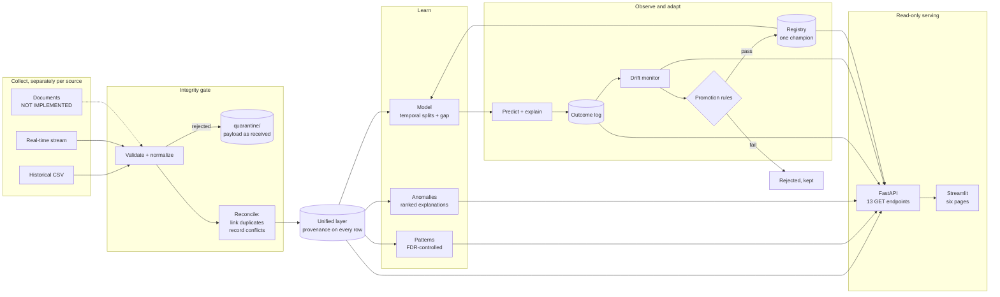

# Architecture

> Status: Phase 9 — v1 is feature-complete. Every layer below exists as tested code except
> **document intelligence** and **recommendations**, which are documented stubs; see the README's
> [not implemented](../README.md#not-implemented) table. `SPEC.md` section 47 holds the original
> conceptual diagram.

## The whole system



The dotted edge is the one unimplemented path. Everything in the serving box **reads**: it opens
artifacts the pipeline wrote and recomputes nothing, which is what keeps a page from disagreeing
with the report it is displaying.

## Lifecycle

```
COLLECT -> SEPARATE -> VALIDATE -> NORMALIZE -> DETECT DUPLICATES/CONFLICTS
 -> RECONCILE -> UNIFIED DATA -> DISCOVER PATTERNS -> DETECT ANOMALIES
 -> PREDICT -> EXPLAIN -> OBSERVE OUTCOME -> ANALYZE ERRORS -> DETECT DRIFT
 -> ADAPT MODEL -> VALIDATE NEW MODEL -> VERSION MODEL -> LEARN
```

The ordering is the point. Three properties follow from it and shape every module:

**Sources are validated separately before they are combined.** Historical, real-time and document
data each have their own pipeline. Mixing them earlier would make a wrong number untraceable to the
stream that produced it.

**Reconciliation is a distinct stage, not a side effect of merging.** Duplicates and conflicts are
detected and dispositioned explicitly. Nothing is resolved by last-write-wins.

**Adaptation is gated.** New data does not trigger retraining. Drift triggers a *candidate*, and the
candidate replaces the champion only by passing predefined criteria.

## Layers

| Layer | Package | Responsibility |
|---|---|---|
| Schema | `urbansense.schemas` | The canonical `Observation` contract and its invariants |
| Config | `urbansense.config` | Problem registration, metrics, units, aliases, thresholds |
| Ingestion | `urbansense.ingestion` | Three independent streams + synthetic streaming simulator |
| Document intelligence | `urbansense.document_intelligence` | Parse, extract, score confidence, route to review — **stub, not implemented** |
| Normalization | `urbansense.preprocessing` | Schema, time, unit and location normalization |
| Integrity | `urbansense.data_integrity` | Duplicates, conflicts, outliers, sensor health, quarantine, leakage |
| Patterns | `urbansense.patterns` | Temporal, spatial, conditional patterns and their evolution |
| Anomaly | `urbansense.anomaly` | Deviation detection plus contextual investigation |
| Features / Prediction | `urbansense.features`, `urbansense.prediction` | Leakage-aware features; probability, severity, timing |
| Explainability | `urbansense.explainability` | Attributions, stated as contribution rather than cause |
| Evaluation | `urbansense.evaluation` | Outcome store, sliced error analysis, experiments |
| Drift / Adaptation | `urbansense.drift`, `urbansense.adaptation` | Drift signals; champion/challenger gating |
| Recommendations | `urbansense.recommendations` | Interventions and observed outcomes — **stub, not implemented** |
| Experiments | `urbansense.experiments` | The three-arm comparison, pre-registered and multi-seed |
| API | `urbansense.api` | Read-only HTTP over the stored artifacts. Root `api/` points here |
| Dashboard | `urbansense.dashboard` | Streamlit pages. Root `dashboard/` points here |

## Why the schema is the foundation

Every layer above reads and writes one type, `Observation`. Putting the project's guarantees into
that type as validators — rather than into each pipeline as review-enforced convention — means a
violation fails at construction, in the module that caused it, with a message naming the rule.

The invariants and the validators that enforce them are tabulated in the
[README](../README.md#why-the-schema-came-first); the reasoning behind each lives in
[`data.md`](data.md).

## Data flow through the directories

```
data/raw/        append-only; the source of truth
  |
  |  ingestion + source-specific validation
  |
  +--> quarantine/      anything invalid, conflicting or suspicious, payload intact
  |
  |  normalization (units, time, location) - originals retained
  |  integrity engine (duplicates linked, conflicts marked)
  v
data/processed/  validated, reconciled, fully regenerable from raw
  |
  |  features -> models/artifacts/ (weights) + models/registry/ (metadata)
  |  predictions -> outcome store -> error analysis -> drift -> candidate model
  v
reports/         experiment results, reported as measured
```

`data/processed/` is disposable by construction: it can always be rebuilt from `data/raw/` plus the
provenance on each record.

## Source-specific views precede the unified view

The dashboard and API expose historical, real-time and document views separately *before* the
unified one (SPEC section 20). A combined number that a user cannot decompose back into its
contributing streams is a number they cannot audit — so the unified layer retains source references
rather than flattening them away.

As built: the dashboard's Data Health page shows **per-source health first**, then the unified
counts, because a healthy total hides a failed feed — on the demo dataset `sensor-B7` is `failed`
while the aggregate looks fine. Every `/data/unified` item carries `source_id`, `source_type`, all
three timestamps and its `provenance` block, so "where did this value come from?" is answerable from
one response. Both are asserted by tests.

## What the serving layer deliberately does not do

The API and dashboard **read**. No endpoint writes, no page triggers a pipeline run, and no request
trains anything. Two consequences worth stating, because both look like gaps until the reason is
given:

- **A missing artifact is an empty page with a command, not an error.** A fresh clone has no
  discovery report. Answering `500` would imply a fault; answering `200` with "run
  `python scripts/discover_patterns.py`" is true and actionable.
- **The unified layer is materialized, not rebuilt on request.** Rebuilding it from CSV takes about
  half a minute, so `urbansense.api.export` writes it to `data/processed/` once and the servers only
  ever open files. That is what keeps "read-only" a property of the process rather than only of the
  HTTP verbs.
